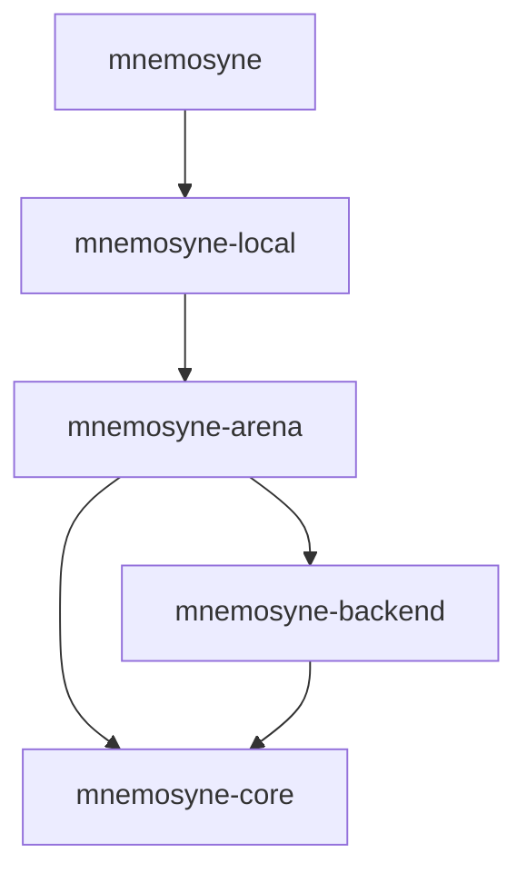

# Mnemosyne: A High-Performance User-Space Memory Allocator in Rust

Mnemosyne—named after the Greek goddess of memory—is a high-performance, lock-free memory allocator implemented completely in Rust. It utilizes a deep vertical hierarchical multi-crate workspace layout to enforce the Separation of Concerns (SoC), Single Responsibility Principle (SRP), Single Source of Truth (SSOT), Dependency Inversion Principle (DIP), and Don't Repeat Yourself (DRY) paradigms.

Its design incorporates core lessons from modern allocator research (specifically **mimalloc** and **snmalloc**), implementing thread-local fast-path caches, lock-free contention-free cross-thread message queues, and zero-cost compile-time allocation safety policies.

---

## Architectural Highlights

### 1. Zero-Cost Compile-Time Safety Policies (`AllocPolicy`)
*   **Compile-Time Configuration**: Parameterized via Zero-Sized Types (ZSTs) and a sealed `AllocPolicy` trait. This shifts optimization branch decisions to compile-time (dead code elimination), carrying absolute zero runtime performance cost.
*   **Backwards Compatibility**: The standard `Mnemosyne` global allocator routes allocations to `StandardPolicy` by default, preserving direct static initialization (e.g. `static ALLOCATOR: Mnemosyne = Mnemosyne;`).
*   **Secure Routing**: The generic `MnemosyneAllocator<P: AllocPolicy>` allows static injection of safety layers such as `SecurePolicy`, which guarantees zero-initialization on allocation and memory poisoning (`0xDE` write pattern) at the deallocation boundary.
*   **Inline Pointer Protection**: Poisoning of freed blocks occurs strictly before they are linked into the free list, avoiding next-pointer corruption inside the inline payload.

### 2. Contention-Free Cross-Thread Free Queueing (Snmalloc Style)
*   Cross-thread and re-entrant frees route through each owning page's atomic free queue rather than contending on page locks, central pools, or an allocator-level incoming queue.
*   Reclamation of remote frees is batched and executed strictly after local free lists are exhausted, preserving the hot allocation path while keeping page ownership explicit.

### 3. Orphaned Segment Adoption & Reuse
*   When a thread terminates, its active segments are not immediately returned to the OS. Partially occupied segments are pushed to a lock-free `GLOBAL_ORPHAN_POOL`.
*   Active threads seeking new pages scan this pool and adopt orphaned segments, scanning for empty pages to repurpose (recycling them across different size classes) and resuming allocations from partially filled pages, eliminating address-space leaks.

### 4. Zero-Panic Library Assurance
*   The production library crates (`mnemosyne-core`, `mnemosyne-arena`, `mnemosyne-backend`, `mnemosyne-local`) are completely free of `.unwrap()`, `.expect()`, and explicit `panic!` pathways, ensuring absolute runtime stability under memory constraints.

---

## Multi-Crate Workspace Layout

The project resides in a deep vertical module hierarchy:



*   **[mnemosyne](file:///d:/Mnemosyne/crates/mnemosyne)**: The public shell global allocator interface and telemetry endpoints.
*   **[mnemosyne-local](file:///d:/Mnemosyne/crates/mnemosyne-local)**: Thread-local cache (`ThreadAllocator`) and size-class fast-path routing.
*   **[mnemosyne-arena](file:///d:/Mnemosyne/crates/mnemosyne-arena)**: Global aligned segment management, page slicing, and orphan pools.
*   **[mnemosyne-backend](file:///d:/Mnemosyne/crates/mnemosyne-backend)**: Page allocation adapter mapping to virtual memory primitives (`VirtualAlloc`/`VirtualFree` on Windows; `mmap`/`munmap` on Unix).
*   **[mnemosyne-core](file:///d:/Mnemosyne/crates/mnemosyne-core)**: Shared size-class logic, atomic collections, constants, and compile-time policies.
*   **[mnemosyne-benchmarks](file:///d:/Mnemosyne/crates/mnemosyne-benchmarks)**: Criterion performance harness and memory usage report utilities.

---

## Usage Guide

To register Mnemosyne as your global allocator using the default, high-performance `StandardPolicy`:

```rust
use mnemosyne::Mnemosyne;

#[global_allocator]
static ALLOCATOR: Mnemosyne = Mnemosyne;

fn main() {
    let x = Box::new(42);
    assert_eq!(*x, 42);
}
```

To use the compile-time `SecurePolicy` (zero-initialization and freed payload poisoning):

```rust
use mnemosyne::{MnemosyneAllocator, SecurePolicy};

#[global_allocator]
static ALLOCATOR: MnemosyneAllocator<SecurePolicy> = MnemosyneAllocator::new();

fn main() {
    let x = Box::new(42);
    assert_eq!(*x, 42);
}
```

To read allocator telemetry mapping, purging, and thread caching stats at runtime:

```rust
use mnemosyne::memory_stats;

fn main() {
    let stats = memory_stats();
    println!("Mapped Bytes: {}", stats.current_mapped_bytes);
    println!("Peak Mapped Bytes: {}", stats.peak_mapped_bytes);
    println!("Purged Segments: {}", stats.purged_segments);
}
```

---

## Verification & Benchmarks

### Running Tests
Execute the workspace unit and integration tests:
```bash
cargo test --workspace
```

### Running the Memory Report
Execute the memory report scenario verifying segment eviction bounds and manual pool purging:
```bash
cargo run -p mnemosyne-benchmarks --bin memory_report --release
```

### Running the Performance Benchmarks
To compare Mnemosyne, MiMalloc, and SnMalloc performance across latency, bursts, threaded cycles, and saturated threaded cycles:
```bash
# Run Criterion microbenchmarks
cargo bench -p mnemosyne-benchmarks --bench allocator_bench -- --quick

# Extract estimates and generate side-by-side comparison report
cargo run -p mnemosyne-benchmarks --bin benchmark_summary --release
```

The `Threaded small allocation cycles` group preserves the historical four-worker measurement with one bounded-channel command per Criterion sample. The `Threaded saturated small allocation cycles` group uses the same workers with a larger per-command allocation count, reducing benchmark coordination overhead relative to allocator work.
Only the saturated threaded row is included in the selected threshold baseline; the historical threaded row remains visible in comparison tables as a continuity signal.
The memory report includes page-refill, recycle, fresh-page, fresh-segment, orphan-adoption, and recycle-sweep counters so cold-path allocation behavior can be checked without adding hot-path atomics.
Benchmark runner contract failures print explicit `benchmark failure: <context>: <detail>` diagnostics instead of assertion or channel unwrap panics.
Unsafe benchmark operations carry local safety comments for dynamic symbols, unchecked layouts, allocator calls, and segment-cache cycles.
The CUDA unified-memory backend uses a three-state initialization gate for race-free dynamic symbol resolution, tracks managed allocations in a fixed-size registry, and falls back to the host backend when CUDA is unavailable or registry capacity is exhausted.

For the latest detailed side-by-side benchmark comparison tables against competitor allocators, see `benchmarks/allocator_comparison.md`.
