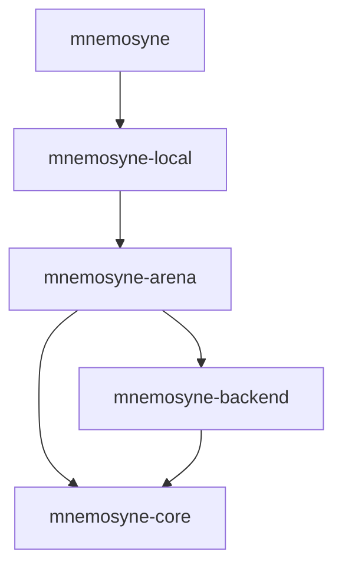

# Mnemosyne: A High-Performance User-Space Memory Allocator in Rust

Mnemosyne—named after the Greek goddess of memory—is a high-performance, lock-free memory allocator implemented completely in Rust. It utilizes a deep vertical hierarchical multi-crate workspace layout to enforce the Separation of Concerns (SoC), Single Responsibility Principle (SRP), Single Source of Truth (SSOT), Dependency Inversion Principle (DIP), and Don't Repeat Yourself (DRY) paradigms.

Its design incorporates core lessons from modern allocator research (specifically **mimalloc** and **snmalloc**), implementing thread-local fast-path caches, lock-free contention-free cross-thread message queues, and zero-cost compile-time allocation safety policies.

---

## Architectural Highlights

### 1. Zero-Cost Compile-Time Safety Policies (`AllocPolicy`)
*   **Compile-Time Configuration**: Parameterized via Zero-Sized Types (ZSTs) and a sealed `AllocPolicy` trait. This shifts optimization branch decisions to compile-time (dead code elimination), carrying absolute zero runtime performance cost.
*   **Backwards Compatibility**: The standard `Mnemosyne` global allocator routes allocations to `StandardPolicy` by default, preserving direct static initialization (e.g. `static ALLOCATOR: Mnemosyne = Mnemosyne;`).
*   **Secure Routing**: The generic `MnemosyneAllocator<P: AllocPolicy>` allows static injection of safety layers such as `SecurePolicy`, which guarantees zero-initialization on allocation and memory poisoning (`0xDE` write pattern) at the deallocation boundary.
*   **Inline Pointer Protection**: Poisoning of freed blocks occurs strictly before they are linked into the free list, avoiding next-pointer corruption inside the inline payload.

### 2. Contention-Free Cross-Thread Free Queueing (Snmalloc Style)
*   Cross-thread and re-entrant frees route through each owning page's atomic free queue rather than contending on page locks, central pools, or an allocator-level incoming queue.
*   Reclamation of remote frees is batched and executed strictly after local free lists are exhausted, preserving the hot allocation path while keeping page ownership explicit.

### 3. Orphaned Segment Adoption & Reuse
*   When a thread terminates, its active segments are not immediately returned to the OS. Partially occupied segments are pushed to a lock-free `GLOBAL_ORPHAN_POOL`.
*   Active threads seeking new pages scan this pool and adopt orphaned segments, scanning for empty pages to repurpose (recycling them across different size classes) and resuming allocations from partially filled pages, eliminating address-space leaks.

### 4. Zero-Panic Library Assurance
*   The production library crates (`mnemosyne-core`, `mnemosyne-arena`, `mnemosyne-backend`, `mnemosyne-local`) are completely free of `.unwrap()`, `.expect()`, and explicit `panic!` pathways, ensuring absolute runtime stability under memory constraints.
*   Structurally guaranteed invariants in `ThreadAllocator::alloc`, `alloc_cold`, `get_new_page`, and `try_recycle_page` compile down to `debug_assert!` + `core::hint::unreachable_unchecked()`, keeping the release-mode hot path branch-free while preserving full debug-build validation.

### 5. Centralized Allocation Request Validation
*   `mnemosyne-core::validation` exposes two `const fn` predicates — `is_valid_alloc_request` for unsafe direct entry points and `is_valid_layout_alloc_request` for `Layout`-validated `GlobalAlloc::alloc` callers.
*   Every allocation entry point (`thread_alloc`, `thread_alloc_layout`, `allocate_large_or_huge`) routes through the same single-source predicates, so a change to `MAX_ALLOC_SIZE`, the power-of-two alignment requirement, or the `SEGMENT_SIZE` alignment cap edits exactly one definition while monomorphization keeps every call site branch-for-branch identical to the prior inlined checks.

### 6. Cache-Line-Aligned Page Metadata
*   `Page` is exactly 64 bytes — one cache line on 64-bit targets — and the layout is pinned by `page_struct_size_stays_within_one_cache_line`. Every fast-path allocation reads and writes `page.free`, `page.local_free`, `page.alloc_count`, and `page.block_size` from a single contiguous cache line.
*   The dead `Page::segment` back-pointer field was removed: callers always recover the parent segment by rounding the page address down to `SEGMENT_ALIGN`, eliminating 32 stores per fresh segment initialization.

### 7. Backend Release Accounting
*   `MemoryBackend::deallocate` returns a release-success boolean and is marked `#[must_use]`. `MemoryBackendWrapper` defers `current_mapped_bytes` decrements to confirmed OS release and routes failures through a dedicated `record_unmap_failure` path that increments only the call counter, so a failed `munmap`/`VirtualFree` cannot leave the telemetry counter under-counting still-mapped bytes.
*   `purge_segment_pool` counts only confirmed releases as purged and pushes failed releases back into the retained pool, preserving ownership metadata on backend failure.

### 8. Transparent Huge Page Hint (Linux)
*   `UnixBackend::allocate` issues `madvise(MADV_HUGEPAGE)` on Linux for mappings that are at least one full `SEGMENT_SIZE` (2 MiB) and a multiple thereof. The kernel can then back each segment with a single 2 MiB transparent huge page, halving TLB pressure on hot segment-metadata access.
*   The advice is purely advisory and ignored on kernels without THP support; the mapping itself is never invalidated by a hint failure. Non-Linux Unix targets compile a no-op stub.

### 9. Page-Level OS Reclaim (`page_reset` and `reset()`)
*   `MemoryBackend::page_reset(ptr, size) -> bool` lets a backend release the physical backing of an idle page range while keeping the virtual mapping committed: `MADV_DONTNEED` on Linux, `MADV_FREE` on macOS/FreeBSD, `VirtualAlloc(MEM_RESET)` on Windows. The default trait impl returns `false` so backends without an equivalent operation silently opt out.
*   `mnemosyne::reset()` drives `reset_segment_pool` which drains the retained free-segment pool, asks the backend to drop the physical backing of each cached segment's mapping, and pushes the segments back into the cache so the address-space stays warm.
*   `MemoryBackendWrapper` records `page_reset_calls` and `page_reset_bytes` telemetry on confirmed resets; the arena pool tracks `reset_calls` and `reset_segments` separately. Neither path decrements `current_mapped_bytes` - the virtual mapping remains owned by the allocator and only the resident set drops.
*   This complements `purge()` (which releases both address space and RSS) as a lighter-weight RSS-reduction knob for idle periods.

### 10. Segment-Tail Guard Region (`make_guard`)
*   `MemoryBackend::make_guard(ptr, size) -> bool` installs a `PROT_NONE` (Unix `mprotect`) or `PAGE_NOACCESS` (Windows `VirtualProtect`) region inside an active mapping. The address range stays reserved and is releasable via `deallocate`, but any read or write raises an access-violation fault.
*   The opt-in `mnemosyne-arena/segment-tail-guards` feature installs a 4 KiB guard at `aligned_addr + SEGMENT_SIZE` on every fresh OS-backed segment, inside the alignment slack the arena already reserves. Forward OOB writes that walk past the last user page (Page 31) trap on the guard instead of corrupting an unrelated mapping.
*   `MemoryBackendWrapper` records `guard_install_calls` and `guard_install_bytes` telemetry on confirmed installs and intentionally does not decrement `current_mapped_bytes`. The install is best-effort: backends without `make_guard` support (default impl) or kernels with an OS page size larger than the guard size (macOS-arm64) silently skip without affecting correctness.
*   The default feature set leaves segment-tail guards disabled so production builds and benchmark runs keep zero guard-install overhead.

### 11. `usable_size` API and In-Place `realloc`
*   `mnemosyne::usable_size(ptr)` returns the allocator's actual reservation for a previously-allocated pointer — the size-class block size for small allocations (which may exceed the original request because Mnemosyne rounds up to the next class), the distance from the user pointer to the end of the payload mapping for huge allocations, and 0 for null. Mirrors `mi_usable_size` (mimalloc) and `malloc_usable_size` (glibc/jemalloc).
*   `Mnemosyne` and `MnemosyneAllocator<P, B>` override `GlobalAlloc::realloc` to consult `usable_size(ptr)` first and return the same pointer unchanged when the new size fits inside the existing size-class block. This eliminates the alloc/copy/free round trip on the common `Vec::push` capacity-rounding case. Secure policies keep replacement allocation on growth so new bytes are zero-initialized.
*   Small-allocation probes read the target page's size-class metadata directly and fall back to the huge-allocation metadata slot only for uninitialized large/huge pages.

### 12. Tight Huge-Allocation Mapping Derivation
*   `allocate_large_or_huge` reserves exactly `size + alignment + SEGMENT_ALIGN + PAGE_SIZE` from the backend, derived from a four-step layout walk over the worst-case slacks (segment-alignment round-up, page-zero reserved prefix, payload-alignment round-up, payload). The prior derivation over-reserved by an entire `SEGMENT_SIZE`, wasting ~2 MiB − 64 KiB of mapped memory per huge allocation; the tight formula is pinned by `huge_allocation_consumes_tight_mapping_size` which asserts the exact backend telemetry delta.
*   Power-of-two alignments above `SEGMENT_ALIGN` are rejected at the entry point so that free classification can always recover the segment header by segment rounding or metadata-slot lookup, without a side registry.

---

## Multi-Crate Workspace Layout

The project resides in a deep vertical module hierarchy:



*   **[mnemosyne](file:///d:/Mnemosyne/crates/mnemosyne)**: The public shell global allocator interface and telemetry endpoints.
*   **[mnemosyne-local](file:///d:/Mnemosyne/crates/mnemosyne-local)**: Thread-local cache (`ThreadAllocator`) and size-class fast-path routing.
*   **[mnemosyne-arena](file:///d:/Mnemosyne/crates/mnemosyne-arena)**: Global aligned segment management, page slicing, and orphan pools.
*   **[mnemosyne-backend](file:///d:/Mnemosyne/crates/mnemosyne-backend)**: Page allocation adapter mapping to virtual memory primitives (`VirtualAlloc`/`VirtualFree` on Windows; `mmap`/`munmap` on Unix).
*   **[mnemosyne-core](file:///d:/Mnemosyne/crates/mnemosyne-core)**: Shared size-class logic, atomic collections, constants, and compile-time policies.
*   **[mnemosyne-benchmarks](file:///d:/Mnemosyne/crates/mnemosyne-benchmarks)**: Criterion performance harness and memory usage report utilities.

---

## Usage Guide

To register Mnemosyne as your global allocator using the default, high-performance `StandardPolicy`:

```rust
use mnemosyne::Mnemosyne;

#[global_allocator]
static ALLOCATOR: Mnemosyne = Mnemosyne;

fn main() {
    let x = Box::new(42);
    assert_eq!(*x, 42);
}
```

To use the compile-time `SecurePolicy` (zero-initialization and freed payload poisoning):

```rust
use mnemosyne::{MnemosyneAllocator, SecurePolicy};

#[global_allocator]
static ALLOCATOR: MnemosyneAllocator<SecurePolicy> = MnemosyneAllocator::new();

fn main() {
    let x = Box::new(42);
    assert_eq!(*x, 42);
}
```

To read allocator telemetry mapping, purging, and thread caching stats at runtime:

```rust
use mnemosyne::memory_stats;

fn main() {
    let stats = memory_stats();
    println!("Mapped Bytes: {}", stats.current_mapped_bytes);
    println!("Peak Mapped Bytes: {}", stats.peak_mapped_bytes);
    println!("Purged Segments: {}", stats.purged_segments);
}
```

---

## Verification & Benchmarks

### Running Tests
Execute the workspace unit and integration tests:
```bash
cargo test --workspace
```

### Running the Memory Report
Execute the memory report scenario verifying segment eviction bounds and manual pool purging:
```bash
cargo run -p mnemosyne-benchmarks --bin memory_report --release
```

### Running the Performance Benchmarks
To compare Mnemosyne, MiMalloc, and SnMalloc performance across allocation latency, realloc latency, bursts, combined usable-size probes, isolated usable-size metadata queries, threaded cycles, and saturated threaded cycles:
```bash
# Run Criterion microbenchmarks
cargo bench -p mnemosyne-benchmarks --bench allocator_bench

# Extract estimates and generate side-by-side comparison report
cargo run -p mnemosyne-benchmarks --bin benchmark_summary --release

# Enforce selected Mnemosyne regression thresholds against the baseline excerpt
cargo run -p mnemosyne-benchmarks --bin benchmark_summary --release -- --enforce-thresholds
```

The `Threaded small allocation cycles` group preserves the historical four-worker measurement with one bounded-channel command per Criterion sample. The `Threaded saturated small allocation cycles` group uses the same workers with a larger per-command allocation count, reducing benchmark coordination overhead relative to allocator work.
Only the saturated threaded row is included in the selected threshold baseline; the historical threaded row remains visible in comparison tables as a continuity signal.
The source-controlled baseline is `benchmarks/allocator_baseline_excerpt.csv`; it changes only when `benchmark_summary` is run with `--refresh-baseline`. Current-run generated outputs live under `target/criterion/` (`benchmark_summary.csv`, `allocator_current_excerpt.csv`, `benchmark_baseline_comparison.csv`, and `benchmark_metadata.json`) and are refreshed by normal summary runs.
The memory report includes page-refill, recycle, fresh-page, fresh-segment, orphan-adoption, and recycle-sweep counters so cold-path allocation behavior can be checked without adding hot-path atomics.
Benchmark runner contract failures print explicit `benchmark failure: <context>: <detail>` diagnostics instead of assertion or channel unwrap panics.
Unsafe benchmark operations carry local safety comments for dynamic symbols, unchecked layouts, allocator calls, and segment-cache cycles.
The CUDA unified-memory backend uses a three-state initialization gate for race-free dynamic symbol resolution, tracks managed allocations in a fixed-size registry, and falls back to the host backend when CUDA is unavailable or registry capacity is exhausted.

For the latest source-visible side-by-side benchmark comparison table against competitor allocators, see `benchmarks/allocator_comparison.md`; regenerate it from current Criterion data with `benchmark_summary`.
